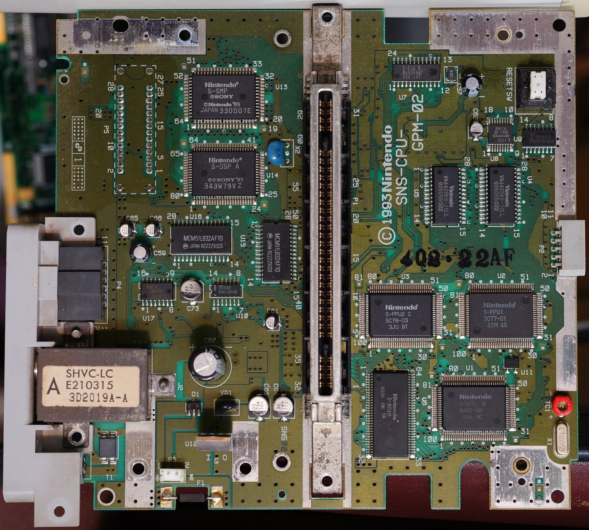

# SHVC-CPU-01

This is a set of electronic schematics to preserve and recreate Super Family Computer also known as Super NES. Based on PDF files created by *Jonathon W. Donaldson* and *arzi84*.

Designed using [KiCAD EDA](https://kicad.org/).

### The primary goal of this project is to verify publicly available schematics for SNS-CPU-GPM-01 (and other revisions) by implementing these in hardware;

The secondary goals of this project are as follows:
1. Recreate the PCB using mixture of original and modern components to fit smaller size case, possibly for portable variant;
1. Get rid of unused components (such as RF modulator, extension ports, etc) or replace them with custom sub-boards or CPLD/FPGA components;
1. Fiddle around with analogue RGB output from S-PPU2 and sniff data bus for possible digital to digital (or digital to VGA) video output;
1. Design a breakout board for video subsystem (S-PPU1, S-PPU2, SRAM) for purpose of BSNES authors to connect such board to a PC and figure out more details for more accurate emulation:
 (drawings by Rodrigo Copetti)

Present limitations:
* ~~S-WRAM chip package is unknown, seems like a custom one, need to measure actual chip and footprint~~ Done, but with impresice tool;
* ~~F411 CIC chip footprint needs verification~~ Done, verified but with imprecise tool;
* ~~S-SMP QFP-64 14x20mm needs custom designed footprint~~ Done, needs verification against real chip;
* My reference board is SNS-CPU-RGB-01;

---
Notes and references:

* S-CPU, S-PPU1, S-PPU2 and S-DSP seem to be PQFP-100 14x20mm
* SRAM, PSRAM are standard SOP-28, footprint redesigned
* F411 CIC seems to be SSOP-18 ~6.1x7.1mm, custom footprint designed
* S-SMP assigned PQFP-64 1.0mm pitch footprint
* S-WRAM assigned SOP-64 0.8mm pitch footprint

* Pin Pitch = 2.5mm (not 2.54mm)
* PCB Thickness = 1.2mm

 (drawings by Rodrigo Copetti)

---

# Work in progress

